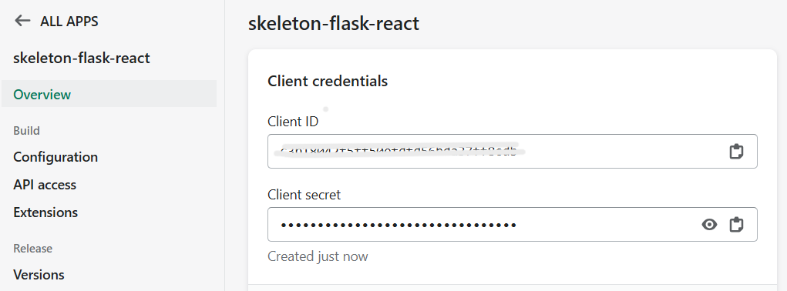

# Skeleton Flask React Shopify App

A production-ready skeleton/template for building Shopify apps with **Flask** backend and **React** frontend. This project provides a complete foundation for creating embedded Shopify applications with modern web technologies.

## 🏖️ What is this?

This is a **skeleton application** with following features:
- **Backend**: Flask (Python) for API endpoints and Shopify integration
- **Frontend**: React with Vite for fast development and modern UI
- **Database**: SQLite3 for lightweight data storage and access token management
- **Authentication**: Complete Shopify OAuth flow implementation
- **Development**: Automated setup with ngrok for local development

## 🔧 Technology Stack
### Backend
- Flask
- Flask-CORS
- SQLite3
- Python-dotenv

### Frontend
- React 18
- Vite
- TypeScript
- Shopify App Bridge

### Development Tools
- ngrok
- Shopify CLI
- Concurrently

### Infrastructure
- Shopify Partners
- ngrok
## ✅ Requirements
- Shopify Partners Account
- Ngrok Auth Token
- Shopify CLI
- Node JS
- Python

## 💡 Installation
### 1. Create Shopify App

**-> Shopify Partners -> Create App**


**-> Enter your app name**


**-> Check the app's client ID/SECRET (for .env)**



### 2. Setup for Backend

**Create virtual environment for Python**
```
cd backend/
python -m venv venv
```

**Activate the venv (this may differ for Mac/Windows)**
```
source venv/Scripts/activate   
```

**Install libraries (flask, flask_cors, etc...)**
```
pip install -r requirements.txt
```

**Create `.env` file** 
```
APP_CLIENT_ID=your-app-client-id
APP_CLIENT_SECRET=your-app-client-secret
APP_SCOPES=your-app-scope
APP_REDIRECT_URI=https://your.ngrok-free.app/auth/callback
SECRET_KEY=random-generated-secret-key
```
(See `.env.template` file)
- __APP_CLIENT_ID & APP_CLIENT_SECRET__: See your app on Shopify Partners
- __APP_SCOPES__: Access scope, example -> read_products,write_products
- __APP_REDIRECT_URI__: The callback URI from Shopify after /auth call (This will be automatically updated by ngrok.js __during dev__.)
- __SECRET_KEY__: Randomly generated secret key to secure flask app, example -> 34asdf032o0osiOAi23ION2AOSIofio0

### 3. Setup for Frontend

**Install Node Packages**
```
cd frontend
npm install
```
### 4. Setup Your Ngrok Config
**Check your ngrok dashboard for the auth token.**
```
ngrok config add-authtoken <TOKEN>
```
**Install ngrok and concurrently package.**

```
npm install
```
### 6. Shopify Config
```
shopify app config link
```

**Select `connect it to an existing app`**

Once it's done, you will have `shopify.app.toml` file in your directory. 
(See `shopify.app.toml.template` file)

### 5. Run Servers
```
npm run dev
```
**This will run `ngrok.js` for several processes.**
- Ngrok server: `ngrok http 500`
- Update Shopify App .toml file: `shopify app deploy -f`
- Flask: `python app.py`
- Vite: `vite`

### 6. Test on Your Dev Store
**Shopify Partners -> Overview -> Test your app**

**Install your app on dev store to test**

## 🚀 Ready to Develop
**Now, the app is embedded, and able to interact with both backend(Flask)/frontend(React)**

